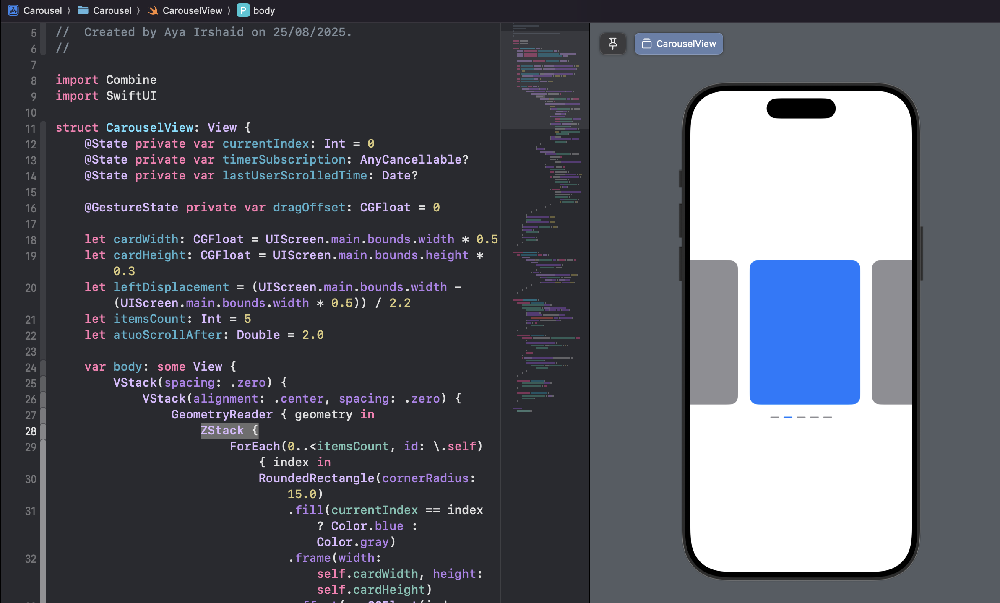
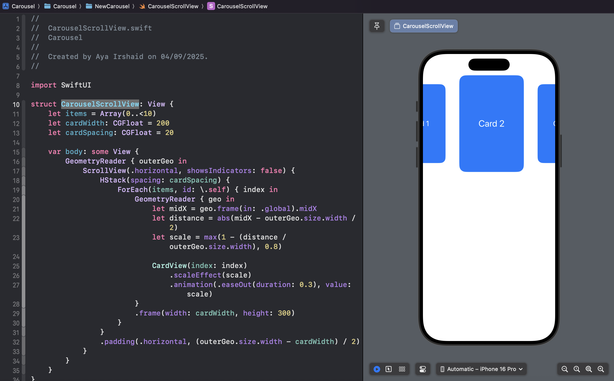

# Carousel
## Experemint carousel different implementations using SwiftUI<h2>
## CarouselView<h2>
_key notes:_
☑️ ZStack
☑️ DragGesture
☑️ autoScroll

## CarouselScrolView<h2>
_key notes:_
☑️ ScrollView

  

